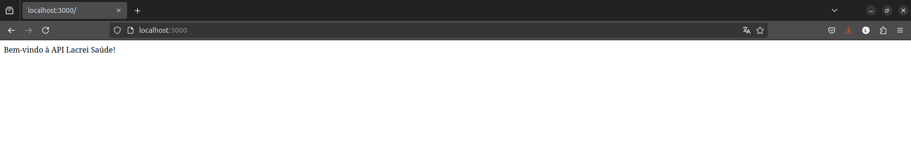

[](https://github.com/92username/desafio-lacrei-saude-devops/actions/workflows/pipeline2.yml)
# Desafio Lacrei Saúde - DevSecOps

## Descrição

Este repositório contém o desafio de DevSecOps para a Lacrei Saúde. O objetivo deste projeto é demonstrar habilidades em DevSecOps, envolvendo a criação, configuração e automação de um pipeline de CI/CD seguro. Este é um projeto voluntário e representa a segunda tentativa de completar o desafio.

## Objetivos

- Implementar um pipeline de CI/CD utilizando melhores práticas de DevSecOps.
- Garantir a segurança e a integridade do código durante todo o ciclo de vida do desenvolvimento.
- Automatizar testes e validações de segurança.
- Documentar todo o processo para facilitar a compreensão e reprodução do projeto.

## Tecnologias Utilizadas

- **JavaScript**: Utilizado para o desenvolvimento de scripts e automações necessárias no pipeline.
- **Docker**: Utilizado para a criação de containers que garantem a consistência do ambiente de desenvolvimento e produção.
- **Dockerfile**: Contém as instruções para a criação das imagens Docker utilizadas no projeto.

## Como Usar

### Pré-requisitos

- [Docker](https://www.docker.com/get-started) instalado na máquina.
- Conta no GitHub para clonar o repositório.

### Passo a Passo

1. Clone o repositório para sua máquina local:
   ```sh
   git clone https://github.com/92username/desafio-lacrei-saude-devops.git
   ```

2. Navegue até o diretório do projeto:
   ```sh
   cd desafio-lacrei-saude-devops
   ```

### Agora você deve definir se a applicação será executada localmente via npm 
### ou via Docker

### Via npm

3. Instale as dependências:
   ```sh
   npm install
   ```
   Para executar a aplicação diretamente:
   ```sh
   npm start
   ```
4. Acesse a aplicação em seu navegador:
   ```
   http://localhost:3000
   ```

**OU**

### Via Docker
5. Construa a imagem Docker:
   ```sh
   docker build -t lacrei-saude-devops .
   ```

6. Execute o container Docker:
   ```sh
   docker run -d -p 3000:3000 lacrei-saude-devops
   ```

7. Acesse a aplicação em seu navegador:
   ```
   http://localhost:3000
   ```


## Funcionamento do Pipeline CI/CD

O pipeline de CI/CD foi configurado para automatizar os seguintes passos:

1. **Build**: Constrói a imagem Docker utilizando o `Dockerfile`.
2. **Test**: Executa testes automatizados para validar a funcionalidade e segurança do código.
3. **Deploy**: Realiza o deploy da aplicação em um ambiente de produção.

## Como Configurar o Pipeline

Para configurar o pipeline de CI/CD, siga os passos abaixo:

1. **Criação do arquivo do pipeline**:
   - O arquivo `pipeline2.yml` deve ser colocado no diretório `.github/workflows/` do seu repositório.

2. **Configuração de Secrets no GitHub**:
   - Se o pipeline requer credenciais (como para o Docker Hub), adicione os **secrets** nas configurações do repositório:
     - Acesse **Settings** > **Secrets**.
     - Adicione as variáveis necessárias (ex: `DOCKER_USERNAME`, `DOCKER_PASSWORD`).

3. **Branches Protegidas**:
   - No repositório, acesse **Settings** > **Branches** e configure a **`main`** como uma branch protegida para garantir que o deploy seja acionado apenas de branches aprovadas.

4. **Acionamento Manual**:
   - O pipeline pode ser acionado manualmente usando a interface do GitHub Actions, graças à configuração de `workflow_dispatch`.


