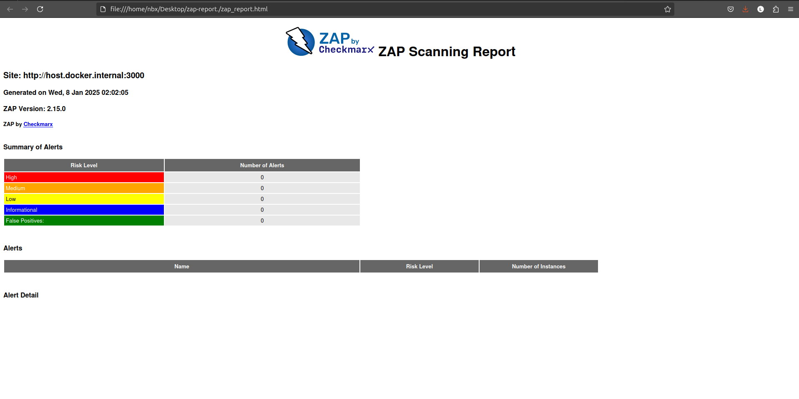

# Relatório de Desenvolvimento - Desafio Técnico DevSecOps - Lacrei Saúde

## Objetivo:
Avaliar os conhecimentos e habilidades da pessoa voluntária em implementar pipelines de CI/CD com foco em segurança e eficiência, utilizando ferramentas e práticas aplicadas na infraestrutura da Lacrei Saúde.

---

## Tarefas do Desafio

### 1. **Setup Inicial**
- [x] **Configurar um repositório no GitHub com a aplicação de exemplo (API básica em Node.js)**

- [x] **Criar um arquivo `Dockerfile` para containerizar a aplicação**
  - Comentários:
  - O **Dockerfile** usa a imagem oficial do **Node.js 18 Alpine** e define **`/app`** como diretório de trabalho. Os arquivos **`package.json`** e **`app.js`** são copiados para o contêiner, e as dependências são instaladas com **`npm install`**. A **porta 3000** é exposta, e o comando **`npm start`** inicia a aplicação.

### 2. **Criação do Pipeline**
- [x] **Configuração do pipeline no GitHub Actions com os seguintes estágios:**

    #### 2.1 **Build**
    - [x] **Instalar as dependências**
    - [x] **Realizar testes unitários (criar um teste simples usando Jest)**
      - Comentários:
      - O pipeline instala as dependências com npm install e executa testes unitários utilizando o Jest através do comando npm test. O Jest é configurado para rodar automaticamente

    #### 2.2 **Análise de Segurança**
    - [x] **Integrar a ferramenta OWASP ZAP para escanear vulnerabilidades na aplicação**
    - [x] **Gerar um relatório de vulnerabilidades como artefato do pipeline**
      - Comentários:
      - A integração da ferramenta OWASP ZAP para escanear vulnerabilidades foi a parte mais difícil deste desafio, pois era uma área nova para mim. A falta de prática e o conhecimento limitado sobre a ferramenta dificultaram o progresso e a finalização dessa tarefa. Embora tenha enfrentado desafios, foi uma oportunidade importante de aprendizado e de evolução na aplicação de práticas de segurança em CI/CD.
    
    

    [Link para o relatório de vulnerabilidades gerado pelo workflow](./assets/zap_report.html)

    #### 2.2.1 **Artefatos do Pipeline**
    - [x] **Acessar os artefatos gerados pelo pipeline**
      - Comentários:
      - Os artefatos gerados pelo pipeline, incluindo relatórios de vulnerabilidades e logs de execução, podem ser acessados diretamente através do link abaixo:

    [Download Github Actions Artifact](https://github.com/92username/desafio-lacrei-saude-devops/actions/runs/12663360286/artifacts/2399287825)

    #### 2.3 **Deploy Simulado**
    - [x] **Simular o deploy realizando um push da imagem Docker para o Docker Hub**
      - Comentários:
      - Este foi o ponto que bloqueou a entrega. Durante o processo de deploy, ocorreu uma mislabeling (atribuição incorreta de nome) do contêiner, o que impediu a execução correta do push para o Docker Hub. Esse erro de nomeação foi identificado e corrigido, permitindo que a tarefa fosse concluída posteriormente. 

### 3. **Requisitos de Segurança**
- [x] **Configurar as permissões do pipeline para que apenas branches protegidas possam acionar o deploy**
  - Comentários:
  - A configuração de permissões foi feita para que o pipeline só seja executado na `main` branch.
- [x] **Configurar secrets no GitHub para armazenar credenciais de acesso ao Docker Hub**

### 4. **Documentação**
- [x] **Adicionar um arquivo `README.md` explicando:**
  - [x] **Como configurar o pipeline**
  - [x] **Como executar a aplicação localmente**
  - [x] **Quaisquer decisões técnicas tomadas durante o desafio**
  - Comentários:
  - Durante o desenvolvimento do desafio, uma decisão importante foi o uso de issues no GitHub para documentar e acompanhar os obstáculos encontrados ao longo do processo. Sempre que surgiam dificuldades ou interrupções no fluxo de trabalho, eu registrava esses desafios como issues, o que me ajudou tanto a acompanhar a evolução do projeto quanto a ter um entendimento mais claro do que estava acontecendo. Essa abordagem me permitiu manter um controle eficiente das pendências e ter uma visão mais detalhada do progresso, além de facilitar a retomada do trabalho após interrupções, garantindo que nenhum ponto fosse esquecido ou negligenciado.
  - Durante o desenvolvimento do desafio, aprendi a importância de adotar a prática de conventional commits, o que foi um dos maiores aprendizados. Durante o processo, enfrentei uma situação em que o pipeline CI estava funcionando corretamente, mas depois de algumas alterações, o fluxo "quebrou". A dificuldade estava em identificar qual modificação causou o erro, já que eu não sabia como reverter alterações de forma eficaz.
  Foi aí que aprendi sobre o comando ``git revert`, que me permitiu reverter alterações de maneira segura, sem perder o histórico do repositório. Além disso, ao adotar a prática de conventional commits, ficou muito mais fácil identificar e acompanhar as mudanças feitas no código. Agora, ao olhar para os commits com mensagens padronizadas, posso rapidamente entender o propósito das alterações e detectar quais podem ter causado problemas, facilitando a correção de falhas.

Como resultado, criei um repositório dedicado para aprender e praticar o uso de conventional commits, disponível em: https://github.com/92username/conventional-commits. Esse aprendizado tem sido fundamental para minha evolução como desenvolvedor e será um grande diferencial no meu desenvolvimento profissional, aplicável a qualquer área de desenvolvimento de software.

### 5. **Entrega**
- [x] **Disponibilizar o link do repositório no GitHub para avaliação**
  - Comentários:
  - https://github.com/92username/desafio-lacrei-saude-devops

---

## **Critérios de Avaliação**

- [ ] **Configuração do CI/CD**: A capacidade de criar um pipeline funcional e bem estruturado.
  - Comentários:
  - 
- [ ] **Integração de Segurança**: Uso adequado do OWASP ZAP e geração de relatórios de vulnerabilidades.
  - Comentários:
  - 
- [ ] **Boas Práticas**: Utilização de secrets, proteção de branches e organização do repositório.
  - Comentários:
  - 
- [ ] **Documentação**: Clareza e completude das instruções no README.
  - Comentários:
  - 
- [ ] **Criatividade e Inovação**: Soluções inteligentes ou melhorias sugeridas no processo.
  - Comentários:
  - 

---

### **Comentários Finais:**
- 
- 
